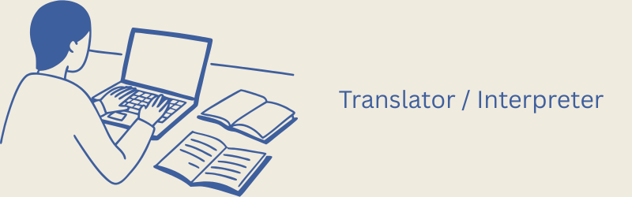
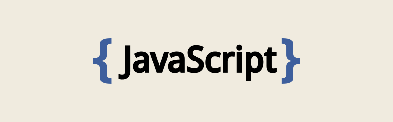

# About Me

## Started from a translator, now a developer

I am an English major, with a never ending passion on the language, still not dying even now. The reason I transitioned from a language field to a tech field simply because I was not satisfied with only possessing one skill - English, I am a relatively competitive person, and programming at the time caught my eyes with its highly intensive logical way of thinking and nature. 

## The first language I've learned wasn't Javascript, it was ... C++

As a frontend developer now who's currently only proficient at Javascript, I didn't start from it. At the time when I thought I was going to commit to learning programming, I was given too many choices of languages to learn, and it was taking me too much time to just choose a language to start learning.

I picked C++ because at the time the only thing I knew about it was: "It is the fastest language in the world".

It didn't matter one bit that it is the fastest, because at the level of my learning at the time, I was ocean apart from ever having to tamper with any performance related codes at all. But I LOVED that language even though I had minimal understanding of it, and thinking back, I still think I learned a lot from how low level C++ can be.

## Now the journey goes on, what then?

Now I'm mostly only coding using Javascript/ NodeJS, I've learned so much from using it to build stuffs, it can achieve almost anything you want to, with the language inherent pros and cons, but nonetheless, it will be enough to get you there.

My expertise in the language, however, has still a lot of room to improve. And thus is also my next goal to fulfill that room. I'm not looking to be perfect at it, but I'm looking to code with it with at least the speed of AI output, that would be what I call, mastering the language.

In the meantime, I have also built some stuffs with Elixir, though I still feel like I know nothing about it because it is truly an enigmatic language. The LSP support, in my opinion, isn't great. But it still remains one of my most favorite languages. 

Thinking back, there isn't a language I actually hate. Contrary to the popular view on r/programmingHumor in Reddit.
## What's next?

I'm having my eye on Golang and maybe Java, I want a high performant language that helps me build my backend. Also Rust too, I mean, there has been noise about Rust for quite a while now, wouldn't hurt to get to know it a little bit.

I'll keep building stuffs and sharing any insights and interesting findings in this blog. I'm really looking forward to my next few years and what would I become. Cheers!
