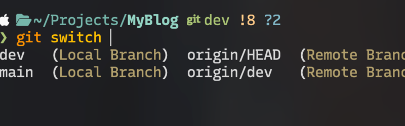
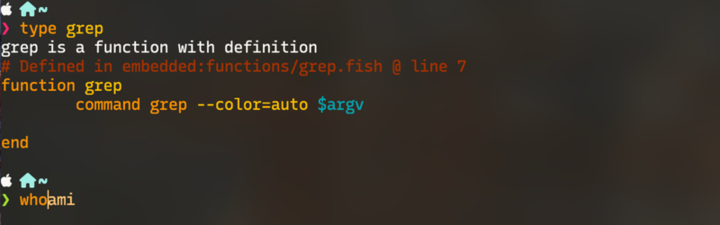

# Reasons Why I still love Fish shell

## Configurability is the root of all evil

As per <abbr title="Fish doc"><a href="https://fishshell.com/docs/current/design.html#configurability-is-the-root-of-all-evil"  target='_blank'>Fish's design</a></abbr>, it declares <b>"Configurability is the root of all evil"</b>, and states that a program should be "smart" enough to offer functionalities that avoids the trouble of users manually configuring it.

Hmm, at the age of individualism crisis amidst all the generic catches-all algorithms that strike to achieve the most successful result, this doesn't seem to bode well but it surprisingly works really well. First, let's be honest, with all the configurations available, do they actually make your usage better or are they often sitting there gathering dust every time? And the only time you need to use them is when the program is not working as they should be, which should be avoided all by itself at first.

Plus, despise this claim, Fish offers a ton of configurations that you will love, especially the keymaps and the themes (speaking for myself personally), and many more. So I will say, Fish put all the configurabilities at the absolute minimum while other softwares try to offer all possible configurabilities from the start.

## The best ootb auto-completion of the world

Fish ships <b>out of the box</b> completion functionalities that not only just works, but also covers as much area as you would like, and never get in your way. Command history that gradually hint you the next word, and you can even search your history by just typing any key word in the command line and hit `up` (or whatever the equipvalent key you've configured it to), it will automatically jumped to that history for you, which is pretty insane not gonna lie. I've tried to achieved the same thing in <abbr title="zsh"><a href="https://ohmyz.sh/" target="_blank">zsh</a></abbr> but it always lacks some part of history here and there or just don't give me the correct history. With Fish? It hits every completion dead on. 

Command history is just the tip of the iceberg, it also autocompletes your git branch (I know, like how?). It somehow also search all your git branches, and if you somehow forget your full branch name but remember a part of it, Fish's amazing partial history search will automatically autocomplete for you too, with the existing branch name.

## Glorious syntax highlighting

Fish's ootb syntax highlighting, again, got everything you need and you have plenty of themes to choose from. Every time you think about some symbol, or even a space between 2 directories in `cd` command, that warrant a syntax color change, Fish will do it. I've heard <b>zsh</b> also has some impressive syntax highlighting configurability. I did try it and it does indeed offer a ton of <b>configurabilities</b> but it does not give you a working one to work with (why?), and when I start implementing plugins to complement its highlight engine, I just ended up replicating Fish with only roughly <40% of what Fish can offer, and I've spent a great deal of time into it to achive that. 

## And many more features await discovering

Fish is a <b>HUGE</b> program that covers a seemingly insurmountable amount of features that wait for you to discover. I've only used what I needed to so I won't be able to even cover <b>basic usage</b> of Fish, if that even exists. I'll continue to ramble about Fish in the future once I discover more fun with it, stay tune.
